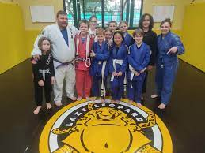

### What is Brazilian Jiu Jitsu?

Brazilian Jiu Jitsu (BJJ) is a practical form of self defense in which the focus is on taking an opponent to the ground in order to neutralize any size, or strength advantages they may have. Once on the ground, the focus is on controlling the opponent using various joint locks, manipulations, or chokes. There are 2 main types of BJJ, gi and no gi, and both can be used effectively for self defense, or sport.

### Who is Jiu Jitsu for: What are the benefits?

Jiu Jitsu is for everyone! Here at Lazy Leopard, we offer BJJ group lessons for kids (ages 5-10), and youth (ages 11-15). Brazilian Jiu Jitsu can have many benefits to your child's life. First and foremost, they will gain comfort in knowing they can defend themselves in situations of conflict. Next, training BJJ will help your child build on the physical concepts they are learning in school such as body awareness, physical strength, and cardio respiratory endurance. Your child will also improve their social skills by interacting with other children through game play, and partner work. Last, but not least, jiu jitsu provides a safe place for children to have FUN!

### About the Coach

Coach Greg is a purple belt in Brazilian Jiu Jitsu, and trains under Professor Bryan Garrison of Chiang Mai BJJ. Coach Greg holds an undergraduate degree in education with a certificate to teach Kindergarten through Grade 12 physical education and health. He also holds a masters degree in sports coaching. He spent 5 years teaching physical education at various international schools around the world before he decided to transition into teaching jiu jitsu full time in 2017. When he isn't teaching, or training, he enjoys Muay Thai, camping, movies, and spending time with his family.

<figure>
  
  <figcaption>
    group photo of a Tuesday  <a href="/schedule.html">kids class</a>
  </figcaption>
</figure>

Testimonial From McNorton:

>I am able to confidently send my kids to this class where I know they will get exellemt training in various tecniques. I know that Greg is constantly working to both improve his martial arts tecniques and his teaching styles. My kids come back from every class having learned something.