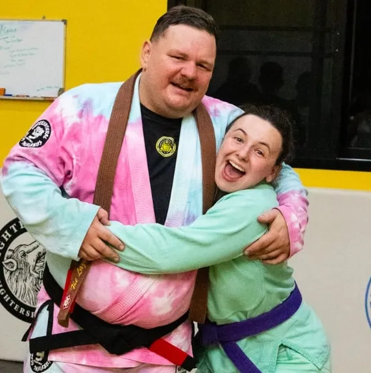

### About the Coach
Coach Greg is a black belt in Brazilian Jiu Jitsu, and trains under [Professor Pritt Mihelson](https://www.defensivebjj.com/) and [Luke Taylor](https://www.instagram.com/luketaylormma/). 

<figure>
  
  <figcaption>
    Greg and Rae
  </figcaption>
</figure>
Coach Greg holds a masters degree in *sports coaching* and an undergraduate degree in education with a certificate to teach Kindergarten through Grade 12 *physical education and health*. He spent 5 years teaching physical education at various international schools around the world before deciding to transition into teaching Brazilian Jiu Jitsu full time in 2017. 

When he isn't teaching, or training, he enjoys Muay Thai, camping, movies, and spending time with his family.

### What is Brazilian Jiu Jitsu?

Brazilian Jiu Jitsu (BJJ) is a practical form of self defense in which the focus is on taking an opponent to the ground in order to neutralize any size, or strength advantages they may have. 

Once on the ground, the focus is on controlling the opponent using various joint locks, manipulations, or chokes. There are 2 main types of BJJ, gi and no gi, and both can be used effectively for self defense, or sport.

### Who is Jiu Jitsu for: What are the benefits?

Jiu Jitsu is for everyone! Here at Lazy Leopard, we offer BJJ group lessons for kids (ages 5-10), and youth (ages 11-15). Brazilian Jiu Jitsu can have many benefits to your child's life. 

First and foremost, they will gain comfort in knowing they can defend themselves in situations of conflict. Next, training BJJ will help your child build on the physical concepts they are learning in school such as body awareness, physical strength, and cardio respiratory endurance. 

Your child will also improve their social skills by interacting with other children through game play, and partner work. Last, but not least, jiu jitsu provides a safe place for children to have FUN!

<iframe src="https://www.facebook.com/plugins/post.php?href=https%3A%2F%2Fwww.facebook.com%2Fmaxdegler%2Fposts%2Fpfbid0ViZ3PdzCYMsv578EbE6UTqmuoi1VJ1UspdUZD5hREqDwqbSR129hBV9w2mDkQSPSl&show_text=true&width=500" width="500" height="228" style="border:none;overflow:hidden" scrolling="no" frameborder="0" allowfullscreen="true" allow="autoplay; clipboard-write; encrypted-media; picture-in-picture; web-share"></iframe>

<iframe src="https://www.facebook.com/plugins/post.php?href=https%3A%2F%2Fwww.facebook.com%2Fcassondra.asla%2Fposts%2Fpfbid0219qNmwkwjzuaqNMzNi1Eq9fui4GwHyyUhynWqZJJoqPxrS5WQwy4HsU58cREWnhnl&show_text=true&width=500" width="500" height="247" style="border:none;overflow:hidden" scrolling="no" frameborder="0" allowfullscreen="true" allow="autoplay; clipboard-write; encrypted-media; picture-in-picture; web-share"></iframe>

<iframe src="https://www.facebook.com/plugins/post.php?href=https%3A%2F%2Fwww.facebook.com%2Fkennanclarke%2Fposts%2Fpfbid02r51E6Hf5hMRkGR8t3ftYg79nmd2f4a1Eupfn6UYnrZExtuGee2SvRhHSmrS5MtfZl&show_text=true&width=500" width="500" height="220" style="border:none;overflow:hidden" scrolling="no" frameborder="0" allowfullscreen="true" allow="autoplay; clipboard-write; encrypted-media; picture-in-picture; web-share"></iframe>

<iframe src="https://www.facebook.com/plugins/post.php?href=https%3A%2F%2Fwww.facebook.com%2Fdaniel.hickman.78%2Fposts%2Fpfbid0V9MT22YiKP5TLoMTVkSxHrW5ftPRTXcgeDMGmEEmMAmHEk7P4iX4KrKTAECVtWC2l&show_text=true&width=500" width="500" height="272" style="border:none;overflow:hidden" scrolling="no" frameborder="0" allowfullscreen="true" allow="autoplay; clipboard-write; encrypted-media; picture-in-picture; web-share"></iframe>

<iframe src="https://www.facebook.com/plugins/post.php?href=https%3A%2F%2Fwww.facebook.com%2Fmewenrich%2Fposts%2Fpfbid02fLQ1HeGqDoLtPErfpM1yHHjWWajzY9FpmX1nXaNTpB4B7KGC7mjpgDXj21rvAUWyl&show_text=true&width=500" width="500" height="317" style="border:none;overflow:hidden" scrolling="no" frameborder="0" allowfullscreen="true" allow="autoplay; clipboard-write; encrypted-media; picture-in-picture; web-share"></iframe>
